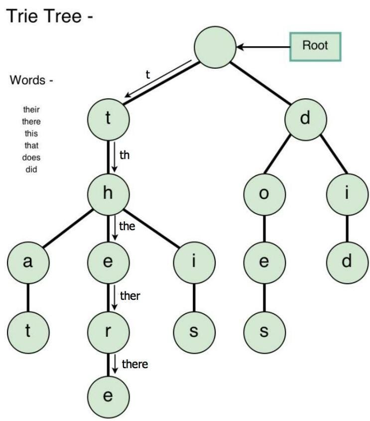
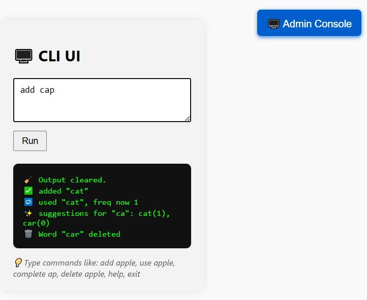
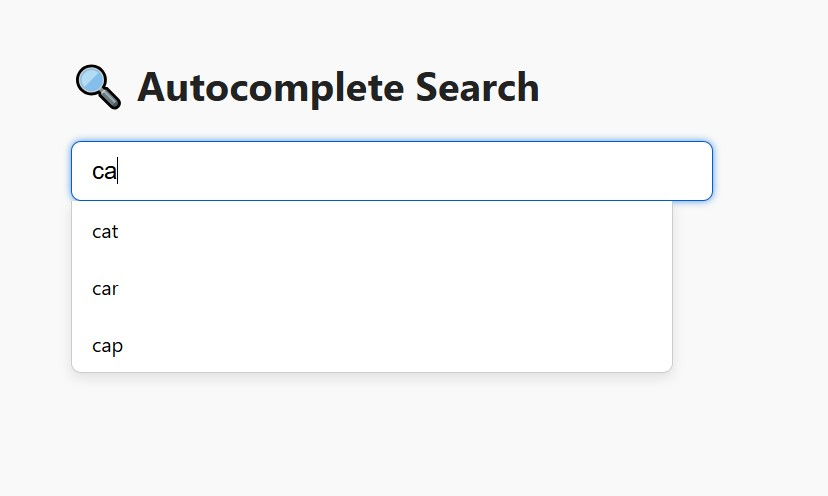

# AutoCompleteTrie Project

Build a console-based autocomplete application using a Trie (prefix tree) data structure. The app suggests word completions based on user input, similar to how search engines work.

---

## Overview

This project implements a fast and memory-efficient autocomplete system using a Trie data structure. It allows adding words, searching for full words, predicting word completions by prefix, and keeping usage statistics to rank suggestions by popularity.

---

## What is a Trie?

A **Trie** (pronounced "try") is a tree-like data structure that stores strings efficiently:

- Each node represents a single character
- Root node is empty
- Each path from root to leaf forms a complete word
- Perfect for prefix-based searches

---

---

## Why use a Trie?

- Searching for a word has **O(m)** time complexity (m = length of word)
- Very efficient for autocomplete and predictive text applications

---

## AutoCompleteTrie Features

- Add words to the dictionary
- Check if a word exists
- Delete words from the dictionary
- Predict word completions for a given prefix
- Track usage frequency to rank suggestions
- Console-based interactive CLI interface
- Web interface with live search and suggestions

### Class: AutoCompleteTrie

- **Properties:**
  - `value` — Character stored in this node
  - `children` — Object containing child nodes
  - `endOfWord` — Boolean flag marking complete words
  - `frequency` — Number of times the word was used (for ranked suggestions)

- **Methods:**
  - `addWord(word)`  
    Adds a word to the trie, creating nodes as needed.
  - `findWord(word)`  
    Returns `true` if the word exists, `false` otherwise.
  - `predictWords(prefix)`  
    Returns an array of possible completions for the given prefix, sorted by usage frequency.
  - `useWord(word)`  
    Increments usage frequency for the word.
  - `deleteWord(word)`  
    Deletes a word from the trie.

---

## Console Interface

Your application supports these commands:

| Command           | Description                           |
| ----------------- | ----------------------------------- |
| `add <word>`      | Add a word to the dictionary         |
| `find <word>`     | Check if a word exists               |
| `complete <prefix>` | Get all word completions for prefix |
| `use <word>`      | Increment usage count for a word    |
| `delete <word>`   | Delete a word from the dictionary   |
| `help`            | Show this command list               |
| `exit`            | Quit the application                 |

---

## Example Console Session

=== AutoComplete Trie Console ===
Type 'help' for commands

> add cat
✓ Added 'cat' to dictionary

> add car
✓ Added 'car' to dictionary

> add card
✓ Added 'card' to dictionary

> complete ca
Suggestions for 'ca': cat, car, card

> find cat
✓ 'cat' exists in dictionary

> find dog
✗ 'dog' not found in dictionary

> help
Commands:
  add <word>      - Add word to dictionary
  find <word>     - Check if word exists
  complete <prefix> - Get completions
  help           - Show this message
  exit           - Quit program

> exit
Goodbye!

---

## Additional Notes

- The trie is **case-insensitive** — words are stored and searched in lowercase.
- The `predictWords` method returns results **sorted by usage frequency** (descending).
- The application supports **full unit testing** for all methods.
- The project can be run as a **console app** or deployed with a **web interface**.

---

## How to Run

### Console

1. Clone the repository  
2. Run `node cli.js` (or your console interface entry point)  
3. Use commands as shown above

### Web

- Open `index.html` in a browser  
- Start typing in the search box to see autocomplete suggestions with word usage frequency and images (if implemented)

---

## Development

- Frequent commits are encouraged to track progress  
- Tests can be run with your testing framework (e.g., Jest) to verify functionality

---

## ScreenShots

  
  

---

## Contact

Created by Elad Laster  
Feel free to open issues or submit pull requests.

